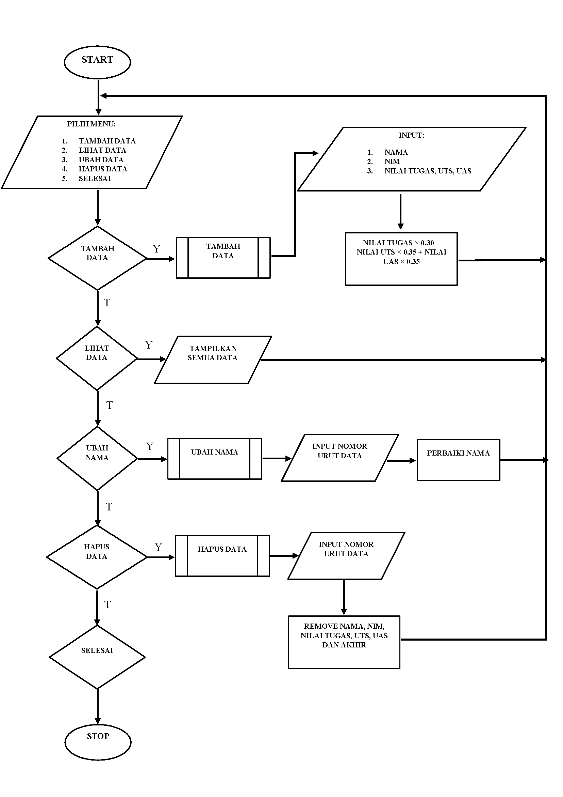

# lab6-7
## flowchart

Dibawah ini adalah code untuk meng-import, karena kita akan gunakan system, untuk mendapatkan clear screen yang ada dalam system os, jika kita perhatikan, disetiap function yang kita buat, terdapat syntax system('cls'), syntax tersebut lah yang kita gunakan dalam hal import system ini. maka kita import terlebih dahulu, berikut code nya:
from os import system
Dibawah ini code untuk membuat list yang akan kita gunakan, karena program yang akan kita buat adalah program daftar nilai mahasiswa, maka kita buat terlebih dahulu list nya
s_nama = []
s_nim = []
s_tugas = []
s_uts = []
s_uas = []
s_akhir = []
Dibawah ini code untuk membuat fungsi judul, karena didalam fungsi, kita dapat memanggil fungsi tersebut berkali-kali tanpa harus mengulang codingannya, hanya perlu dengan cara memanggil fungsi ( contohnya: fungsi() ), setiap kita akan membuat fungsi, maka harus di awali dengan def dan diikuti dengan nama fungsi yang akan kita buat dan gunakan selanjutnya.
def judul():
    print('==================================')
    print('|     Daftar Nilai Mahasiswa     |')
    print('==================================')
Dibawah adalah code untuk membuat fungsi menu
def menu():
    system('cls')
    print('=====================================')
    print('Input Data Nilai Mahasiswa'.center(40))
    print('=====================================')
    print('|    1. Tambah Data                 |')
    print('|    2. Tampilkan Data Mahasiswa    |')
    print('|    3. Ubah Data Mahasiswa         |')
    print('|    4. Hapus Data Mahasiswa        |')
    print('|    5. Selesai                     |')
    print('=====================================')
    choose = input('Pilih Menu  : ')
    if choose == '1':
        tambah()
    elif choose == '2':
        tampilkan()
    elif choose == '3':
        ubah()
    elif choose == '4':
        hapus()
    elif choose == '5':
        selesai()
    else:
        tidak = input('Menu Tidak Ada')
        system('cls')
        menu()
